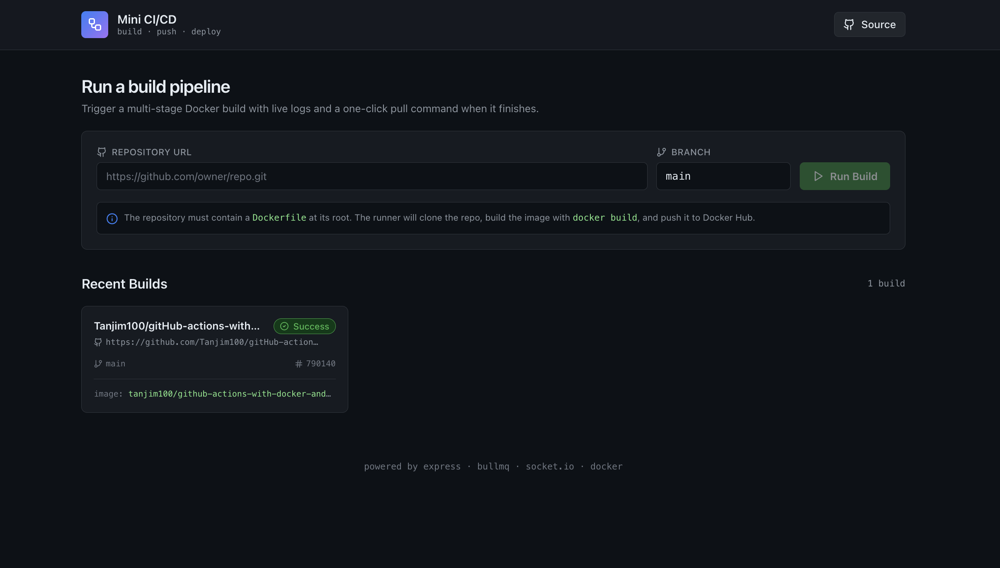
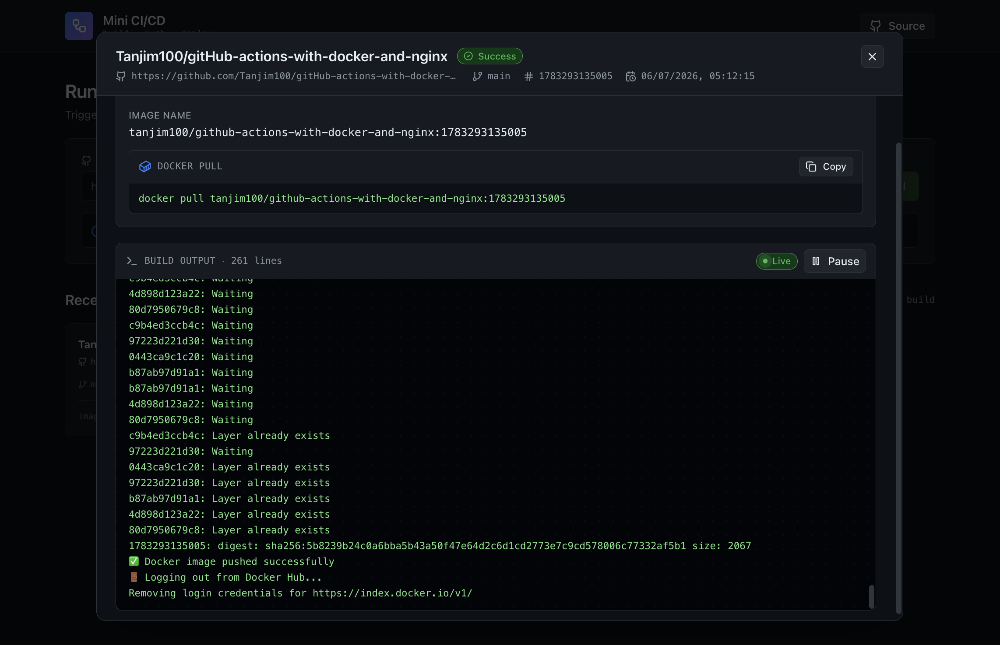

# Mini GitHub Action

> A miniature, self-hosted CI platform that turns any Git repository into a published Docker image — paste a repo URL, watch live build logs, then copy a single `docker pull` command when it finishes.

`mini-github-action` is a from-scratch clone of the GitHub Actions experience rebuilt on Node.js, React, BullMQ, Socket.IO, and the Docker CLI. The system is split into five loosely-coupled services that together clone a repository, build a Docker image from its `Dockerfile`, push the image to Docker Hub, and stream the entire pipeline to a dashboard — all in real time, all behind one REST/WebSocket entry point.

The repository is itself a CI/CD project: GitHub Actions workflows (`ci.yml`, `cd.yml`, `e2e.yml`) validate, build, publish, and deploy the stack on every merge to `main`.




---

## Table of Contents

1. [What is This?](#1-what-is-this)
2. [Architecture (End-to-End Flow)](#2-architecture-end-to-end-flow)
3. [Features](#3-features)
4. [Lab Structure](#4-lab-structure)
5. [API Reference](#5-api-reference)
6. [Active Learning Techniques](#6-active-learning-techniques)
7. [How to Run the Project](#7-how-to-run-the-project)
<!-- 8. [Visual Elements](#8-visual-elements) -->
8. [Quality Assurance](#8-quality-assurance)
9. [Common Mistakes to Avoid](#9-common-mistakes-to-avoid)
10. [Templates and Examples](#10-templates-and-examples)
11. [Review Process](#11-review-process)
12. [Project Roadmap](#12-project-roadmap)

---

## 1. What is This?

This project is a **mini self-hosted Continuous Integration (CI) system**. A user submits a Git repository, and the system automatically creates a **job**, processes it through a **worker**, sends it to a **runner**, clones the repository, and builds the application as a **Docker image** while providing build **status and logs**.

**Why do we need it?**

It automates the repetitive process of fetching and building source code. Instead of relying entirely on third-party CI services, it provides control over the build infrastructure and demonstrates how real CI systems use **job queues, workers, runners, Docker, and real-time loggings**.

**In short:** A simplified, self-hosted alternative for understanding and performing automated CI workflows.


---

## 2. Architecture (End-to-End Flow)


**Service Ports**

| Service  | Container port | Host port (dev) | Purpose                              |
| -------- | -------------- | --------------- | ------------------------------------ |
| frontend | `5173`         | `5173`          | Vite dev server / static preview.    |
| server   | `8000`         | `8000`          | REST API + Socket.IO server.         |
| runner   | `7000`         | `7001`          | Privileged build executor.           |
| worker   | —              | —               | BullMQ consumer (internal only).     |
| redis    | `6379`         | `6379`          | BullMQ broker.                       |


### 🛠️ Tech Stack

| Category              | Technologies                                              |
| --------------------- | --------------------------------------------------------- |
| 🎨 **Frontend**       | React, Vite, Tailwind CSS, React Router, Socket.IO Client |
| 🟢 **Server**         | Node.js, Express.js, Socket.IO, BullMQ, ioredis           |
| 🟣 **Worker**         | Node.js, BullMQ, ioredis, Axios                           |
| 🔵 **Runner**         | Node.js, Express.js, Axios, Git, Docker CLI               |
| 🐳 **Infrastructure** | Docker, Docker Compose, Redis, Docker Hub                 |
| 🚀 **CI Deployment**  | GitHub Actions, AWS EC2                                   |

> The application follows a microservice-style architecture where Redis and BullMQ manage build jobs, the Runner builds Docker images, and Socket.IO provides real-time CI logs and status updates.

---

## 3. Features

- **Git Repository Submission** — Users can provide a Git repository URL and branch for building.
- **Automated Job Creation** — Each build request is assigned a unique job ID.
- **Redis-Based Job Queue** — Build jobs are queued and processed asynchronously.
- **Dedicated Worker Service** — The worker retrieves jobs from the queue and assigns them to the runner.
- **Self-Hosted Runner** — A custom runner executes the CI tasks on our own infrastructure.
- **Automatic Repository** Cloning — The runner automatically clones the submitted repository.
- **Docker Image Building** — The submitted project is automatically converted into a Docker image.
- **Isolated Build Execution** — Docker provides isolated environments for different build jobs.
- **Real-Time Build Logs** — Build progress and command output are sent to the frontend in real time.
- **Job Status Tracking** — Users can monitor states such as queued, running, completed, or failed.
- **Microservice Architecture** — The system is divided into Frontend, Server, Worker, Runner, and Redis services.
- **Dockerized Services** — All major components run as Docker containers.
- **Internal Service Communication** — Docker networking allows services to communicate using service names.
- **CI/CD for the Platform Itself** — GitHub Actions automatically builds and deploys updates to the self-hosted CI platform on AWS EC2.
- **Environment-Based Configuration** — Secrets and service URLs are managed using environment variables and GitHub Secrets.

---

## 4. Lab Structure

> The "lab" of this project is the folder layout. Each part is one instrument; the whole bench is the system.

```
demo-mini-github-action/
├── .github/
│   └── workflows/                  # GitHub Actions CI/CD workflows
│
├── docs/                           # Project documentation
│
├── frontend/                       # Frontend application
│   ├── public/                     # Static assets
│   └── src/
│       ├── api/                    # API client code
│       ├── assets/                 # Images and other assets
│       ├── components/             # Reusable UI components
│       ├── pages/                  # Page-level components
│       └── socket/                 # WebSocket client logic
│
├── runner/                         # Self-hosted CI runner service
│   ├── controllers/                # Request handlers
│   ├── routes/                     # API route definitions
│   └── services/                   # Build and execution logic
│
├── server/                         # Main backend API server
│   ├── config/                     # Configuration files
│   ├── controllers/                # Request handlers
│   ├── routes/                     # API route definitions
│   ├── services/                   # Business logic
│   ├── socket/                     # WebSocket server logic
│   └── store/                      # Job and application data storage
│
├── worker/                         # Background job worker
│   ├── processors/                 # Job processing logic
│   ├── queue/                      # Redis/BullMQ queue management
│   └── services/                   # Worker service logic
│
├── docker-compose.yml              # Local development configuration
├── docker-compose.prod.yml         # Production configuration
├── .gitignore                      # Git ignored files
└── README.md                       # Project overview and instructions
```

### 4.1 `frontend/` — the dashboard

React 19 + Vite 7 + Tailwind 3. The Vite dev server is exposed on port `5173`. The frontend's only responsibilities are (a) letting the user submit a job, (b) listing recent jobs with their live status, and (c) showing the modal that contains the live logs and the final `docker pull` command.

Important files:
- `src/pages/Home.jsx` — header, hero, job form, jobs grid, empty state.
- `src/components/JobForm.jsx` — repository URL + branch input, submission state.
- `src/components/JobCard.jsx` — dashboard tile with live status pill and image preview.
- `src/components/JobModal.jsx` — modal containing `ImageInstallPanel` + `LogsPanel`.
- `src/components/LogsPanel.jsx` — terminal-style log viewer with smart tail-mode.
- `src/components/StatusBadge.jsx` — queued / running / success / failed / cloned pill.
- `src/components/CopyBlock.jsx` — `docker pull` block with one-click clipboard copy.
- `src/components/ImageInstallPanel.jsx` — header + image name + `docker pull` block.
- `src/api/jobApi.js` — `fetch`-based `createJob` that calls `POST /api/jobs`.
- `src/socket/socket.js` — singleton `socket.io-client` connection.

The frontend reads two build-time configuration values from `.env`:
```
VITE_API_URL=http://localhost:8000
VITE_SOCKET_URL=http://localhost:8000
```

### 4.2 `server/` — the API + WebSocket gateway

Express 5 + Socket.IO 4 + BullMQ 5 + ioredis. The server is the only service that accepts user input. It is responsible for:

1. Validating incoming job requests.
2. Persisting jobs in an in-memory `Map` (`server/store/jobStore.js`).
3. Enqueuing jobs on the BullMQ `build-queue`.
4. Accepting log/status/image callbacks from the runner.
5. Broadcasting log and status updates to the browser via Socket.IO.

Important files:
- `index.js` — boots Express + HTTP server + Socket.IO.
- `app.js` — registers routes: `/api/jobs`, `/api/logs`, `/api/status`, `/api/image`, `/health`.
- `controllers/job.controller.js` — `createJob` (mints an ID, stores, enqueues) and `getJob`.
- `controllers/log.controller.js` — appends runner logs to the job store + emits them.
- `controllers/status.controller.js` — updates status in store + emits to the Socket.IO room.
- `controllers/image.controller.js` — stores the final image name from the runner.
- `controllers/health.controller.js` — returns service health for the CI workflow.
- `services/queue.service.js` — BullMQ producer: `addJobToQueue(job)`.
- `services/job.service.js` — `appendLog(jobId, log)` helper used by the log controller.
- `socket/socket.js` — Socket.IO server: `initSocket`, `emitLog`, `emitStatus`.
- `store/jobStore.js` — in-memory job map (no persistence; see §10).
- `config/redis.js` — singleton `ioredis` connection to the `redis` service.

Endpoint summary:

| Method | Path                | Purpose                                                                 |
| ------ | ------------------- | ----------------------------------------------------------------------- |
| POST   | `/api/jobs`         | Create a new build job. Body: `{ repoUrl, branch }`.                    |
| GET    | `/api/jobs/:id`     | Read a job (used as a polling fallback for image updates).              |
| POST   | `/api/logs`         | Append a log line to a job. Body: `{ jobId, message }`.                 |
| POST   | `/api/status`       | Update a job's status. Body: `{ jobId, status }`.                       |
| POST   | `/api/image`        | Set the final image name pushed by the runner.                          |
| GET    | `/health`           | Health check.                                                           |

### 4.3 `worker/` — the queue consumer

BullMQ worker over `build-queue`. There is one file that matters: `processors/buildProcessor.js`. It receives a BullMQ job and forwards it to the runner via `services/runnerService.js` (a single `axios.post(RUNNER_URL + "/execute")`).

```
queue  ─► worker (buildProcessor)  ─► runner (POST /execute)
```

The worker's `.env` only needs `RUNNER_URL=http://runner:7000`. It is otherwise stateless.

### 4.4 `runner/` — the privileged executor

This is where the actual build pipeline lives. The runner mounts `/var/run/docker.sock` and runs in privileged mode so it can spawn `docker build`, `docker push`, and `git clone` against the host daemon. Each module has a single responsibility:

- `services/git.service.js` — `cloneRepo(job)` spawns `git clone` into `runner/workspace/<jobId>`.
- `services/build.service.js` — `runBuild(job, repoPath)` runs `npm install` / `npm run build` for Node projects (currently disabled in favor of direct Docker build).
- `services/docker.service.js` — `buildImage(job, repoPath)` runs `docker build -t <user>/<repo>:<jobId> .` against the cloned path.
- `services/registry.service.js` — `login(jobId)` / `logout(jobId)` use `docker login --password-stdin`.
- `services/image.service.js` — `pushImage(jobId, imageName)` runs `docker push` and streams every line to the server.
- `services/imageInfo.service.js` — `sendImage({jobId,imageName})` POSTs to the server's `/api/image`.
- `services/status.service.js` — `sendStatus(jobId, status)` POSTs to the server's `/api/status`.
- `services/log.service.js` — `sendLog(jobId, message)` POSTs to the server's `/api/logs`.
- `services/health.service.js` — health-check helper with retry.
- `controllers/execute.controller.js` — top-level pipeline that orchestrates the above.
- `routes/execute.routes.js` — `POST /execute` mounted at `app.use("/execute", executeRoutes)`.

The runner's `.env` must contain:

```
RUNNER_URL=http://runner:7000    # used by the worker, not the runner itself
SERVER_URL=http://server:8000
DOCKER_USERNAME=<your-dockerhub-user>
DOCKER_ACCESS_TOKEN=<your-dockerhub-pat>
```

### 4.5 `.github/workflows/` — the project's own CI/CD

- **`ci.yml`** — On push / PR to `main`: recreates `.env` files from repo secrets, builds and starts the prod stack, curls `/health` endpoints for server/runner/frontend/redis, submits a fake build job against `https://github.com/octocat/Hello-World.git`, then tears the stack down with `docker compose down -v`.
- **`cd.yml`** — On successful `CI Pipeline` (`workflow_run`): builds and pushes the four production images (`tanjim100/ci-server`, `…ci-worker`, `…ci-runner`, `…ci-frontend`) to Docker Hub, then SSHes into the EC2 host, `git pull`s, recreates the env files, and brings the stack up with `docker compose -f docker-compose.prod.yml up -d`.
- **`e2e.yml`** — Manually triggered (`workflow_dispatch`): same smoke test as `ci.yml` but against the dev compose stack.

---

## 5. API Reference

The system uses two HTTP APIs: the **Server API** for job management and the **Runner API** for executing CI jobs.

### 5.1 Server API

**Base URL:** `http://localhost:8000`

| Method | Endpoint        | Description                           | Response Status |
| ------ | --------------- | ------------------------------------- | --------------- |
| `GET`  | `/`             | Check if the server is running        | `200 OK`        |
| `GET`  | `/health`       | Get server health information         | `200 OK`        |
| `POST` | `/api/jobs`     | Create and queue a new CI job         | `200 OK`        |
| `GET`  | `/api/jobs/:id` | Get a job by its ID                   | `200 OK`        |
| `POST` | `/api/logs`     | Add a build log to a job              | `200 OK`        |
| `POST` | `/api/status`   | Update the status of a job            | `200 OK`        |
| `POST` | `/api/image`    | Store the generated Docker image name | `200 OK`        |

### 5.2 Create a CI Job

**`POST /api/jobs`**

```json
{
  "repoUrl": "https://github.com/user/repo.git",
  "branch": "main"
}
```

**Response — `200 OK`**

```json
{
  "id": "1720953600000",
  "repoUrl": "https://github.com/user/repo.git",
  "branch": "main",
  "status": "queued",
  "logs": [],
  "imageName": null
}
```

### 5.3 Get a Job

**`GET /api/jobs/:id`**

**Response — `200 OK`**

```json
{
  "id": "1720953600000",
  "repoUrl": "https://github.com/user/repo.git",
  "branch": "main",
  "status": "running",
  "logs": ["Cloning repository...", "Building Docker image..."],
  "imageName": null
}
```

### 5.4 Runner API

**Base URL:** `http://localhost:7000`

| Method | Endpoint   | Description                    | Response Status |
| ------ | ---------- | ------------------------------ | --------------- |
| `GET`  | `/`        | Check if the runner is running | `200 OK`        |
| `GET`  | `/health`  | Get runner health information  | `200 OK`        |
| `POST` | `/execute` | Accept and execute a CI job    | `200 OK`        |

### 5.6 Execute a CI Job

**`POST /execute`**

```json
{
  "jobId": "1720953600000",
  "repoUrl": "https://github.com/user/repo.git",
  "branch": "main"
}
```

**Response — `200 OK`**

```json
{
  "accepted": true,
  "jobId": "1720953600000"
}
```

### 5.7 Job Status Values

A CI job can have one of the following statuses:

* `queued` — Waiting for the worker
* `running` — Build is in progress
* `success` — Build and image push completed successfully
* `failed` — The CI pipeline failed

### 5.8 WebSocket Events

The Server uses Socket.IO to send real-time updates to the frontend.

| Event    | Purpose                    |
| -------- | -------------------------- |
| `log`    | Sends real-time build logs |
| `status` | Sends job status updates   |

### 5.9 API Flow

```text
Client → POST /api/jobs
             ↓
        Redis Queue
             ↓
           Worker
             ↓
      POST /execute
             ↓
           Runner
             ↓
   Clone → Build → Push
             ↓
   Update Logs and Status
             ↓
 WebSocket → Frontend
```

> The Worker and Redis do not expose application APIs. They are used internally for background job processing and queue management.

---

## 6. Active Learning Techniques

> This section is for readers who want to extend the project. The recipes below mirror the cognitive science ideas in §2.

### 6.1 Read one service end-to-end before touching another

Pick one of `server`, `worker`, `runner`, or `frontend`. Read its `index.js`, then its top-level routes/controllers, then its services. Don't cross service boundaries until the first one is clear. The system is small enough that you can hold one service in your head; the failure mode of newcomers is to read all five at once.

### 6.2 Trace one job end-to-end

Open five files in your editor, side-by-side:

1. `frontend/src/components/JobForm.jsx` — the entry point.
2. `server/controllers/job.controller.js` — receives the request.
3. `server/services/queue.service.js` — enqueues on `build-queue`.
4. `worker/processors/buildProcessor.js` — dequeues, calls runner.
5. `runner/controllers/execute.controller.js` — the actual pipeline.

Walk the execution with a debugger or with `console.log`s. This is the single highest-leverage exercise in the project.

### 6.3 Modify, don't rewrite

Pick one extension from §11 and add it. Resist the urge to refactor while adding it. Each commit should be small, verifiable, and revertable.

### 6.4 Reproduce a failure on purpose

Stop the runner mid-build (`docker stop ci-runner`). Watch the dashboard: the worker will retry or the job will hang, and the logs will reveal the timeout path. Then start the runner again and confirm recovery. This is the cheapest way to learn the system's fault tolerance.

### 6.5 Pair-program with the Socket.IO room model

Add a `console.log` in `server/socket/socket.js`'s `initSocket`: print `io.sockets.adapter.rooms` on every `connection`. Then open two browser tabs to the same job. The room will contain two socket IDs, both receiving the same `log` events. This visualizes the multicast model and makes it concrete.

---

## 7. How to Run the Project

This section explains how to start the project, configure the required environment variables, submit a build, and run the generated Docker image.

### 7.1 Prerequisites

Before starting, make sure you have:

* Docker
* Docker Compose
* A Docker Hub account

Clone the repository and enter the project folder:

```bash
git clone <repository-url>
cd demo-mini-github-action
```

---

### 7.2 Create the Environment Files

The project requires four `.env` files.

#### `server/.env`

```env
PORT=8000
REDIS_HOST=redis
```

#### `worker/.env`

```env
RUNNER_URL=http://runner:7000
REDIS_HOST=redis
```

#### `runner/.env`

```env
SERVER_URL=http://server:8000
DOCKER_USERNAME=<your-dockerhub-username>
DOCKER_ACCESS_TOKEN=<your-dockerhub-access-token>
```
put your dockerhub username and access token

#### `frontend/.env`

For local development:

```env
VITE_API_URL=http://localhost:8000
VITE_SOCKET_URL=http://localhost:8000
```

For deployment, replace `localhost` with your server's public IP address:

```env
VITE_API_URL=http://<server-public-ip>:8000
VITE_SOCKET_URL=http://<server-public-ip>:8000
```

---

### 7.3 Start the Project

For local development:

```bash
docker compose up --build
```

For production:

```bash
docker compose -f docker-compose.prod.yml up -d
```

Docker will start all required services automatically:

| Service  | Address                 |
| -------- | ----------------------- |
| Frontend | `http://localhost:5173` |
| Server   | `http://localhost:8000` |
| Runner   | `http://localhost:7001` |
| Redis    | Port `6379`             |

Open the frontend in your browser:

```text
http://localhost:5173
```

---

### 7.4 Build a GitHub Repository

From the frontend:

1. Enter the GitHub repository URL.
2. Enter the branch name, such as `main`.
3. Submit the build.
4. The job is added to the Redis queue.
5. The worker sends the job to the runner.
6. The runner clones the repository and builds its Docker image.
7. Build logs and status updates appear on the dashboard.

> The repository must contain a valid `Dockerfile`.

---

### 7.5 Pull the Generated Docker Image

After a successful build, the system provides a command similar to:

```bash
docker pull <dockerhub-username>/<repository-name>:<job-id>
```

Example:

```bash
docker pull tanjim100/my-app:123456
```

If the Docker Hub repository is public, login is not required. For a private repository, log in first:

```bash
docker login
```

---

### 7.6 Run the Generated Image

Run the downloaded image:

```bash
docker run --rm -p <host-port>:<container-port> <image-name>
```

Example:

```bash
docker run --rm -p 3000:3000 tanjim100/my-app:123456
```

Use the container port exposed by the application's `Dockerfile`.

---

### 7.7 Stop the Project

Stop all project containers:

```bash
docker compose down
```

To also remove project volumes:

```bash
docker compose down -v
```

> **Security note:** The runner has access to the host Docker daemon through `/var/run/docker.sock`. Run this system only on a trusted machine or isolated server.


---


## 8. Quality Assurance

> Every layer has its own quality bar. The CI workflow enforces them.

### 8.1 Frontend

- ESLint (`eslint .`) is wired to `npm run lint` and runs in the default Vite scripts. Errors block the build.
- The production build is verified with `npm run build`. We do not commit `dist/`.
- Visual checks: open two browser tabs on the same job; both should show identical logs.

### 8.2 Backend services

- No automated tests are shipped yet; the trusted path is `ci.yml` running the full stack end-to-end and observing /health and a real build attempt.
- A failing container logs to stderr; `docker compose logs` is the first stop in any investigation.

### 8.3 End-to-end

`e2e.yml` is the explicit `workflow_dispatch` button you press when you want to verify a change against the dev compose stack without going through the prod images. Use it for any change that touches `server`, `worker`, or `runner`.

### 8.4 Production

`ci.yml` runs on every push/PR to `main`. `cd.yml` runs only when `ci.yml` succeeded, and only the `if: github.event.workflow_run.conclusion == 'success'` branch deploys. A broken main branch cannot accidentally reach the production EC2 host.

---

## 9. Common Mistakes to Avoid

> The fastest path through a codebase is knowing where its foot-guns live. Here are the ones in this project.

### 9.1 Forgetting `privilegied: true` on the runner

If you remove `privileged: true` or the `/var/run/docker.sock` mount from `docker-compose.yml`, the runner will fail to start `docker build` with a permission error. There is no fallback path; the runner needs the host daemon.

### 9.2 Hardcoding ports

Every cross-service URL uses an environment variable. Resist the temptation to write `http://localhost:8000` inside the worker or runner — `localhost` inside a container refers to the container itself, not the host. Use `http://server:8000` (the Docker Compose service name) or the injected variable.

### 9.3 Treating `jobStore` as durable

`server/store/jobStore.js` is an in-memory `Map`. Restarting the server wipes every job. If you need persistence, back the store with Redis (`ioredis` is already a dep) or a database. Until then, do not assume a server restart preserves history.

### 9.4 Using `Date.now()` as the only ID source

Two jobs submitted in the same millisecond collide. For demos this is fine, but for anything load-bearing, switch to `crypto.randomUUID()` or pass the ID back to the server from the client.

### 9.5 Allowing `git clone` to run on an untrusted URL

If you expose this project publicly, the runner will `git clone` whatever URL is submitted. Add an allowlist in `server/controllers/job.controller.js` before doing so, or run the runner in a network namespace with no egress.

### 9.6 Building non-Docker projects

The current pipeline assumes the repository contains a `Dockerfile`. If you submit a repo without one, `docker build` fails with a clear error. The `npm` build path (`runner/services/build.service.js`) is wired but commented out in `execute.controller.js`; turn it on if you want to support repos without a `Dockerfile`.

### 9.7 Ignoring the modal listener lifecycle

`JobModal.jsx` and `JobCard.jsx` both register a `socket.on("status", handler)` listener. Each `useEffect` cleanup uses `socket.off("status", handler)` with its own handler reference, which works because Socket.IO matches by reference. If you refactor those handlers into a shared utility, double-check that the cleanup still references the same function so the listener is actually removed.

---

## 10. Templates and Examples

### 10.1 README task recipe

```markdown
- id: <T-NNN>
  title: <short verb phrase>
  service: server | worker | runner | frontend | infra
  files: <comma-separated list>
  risk: low | medium | high
  tests:
    - <how to verify>
```

Every change ships with a one-line title, the affected files, a risk classification, and a verification step.

### 10.2 Component template (React)

```jsx
import { useEffect, useState } from "react";
import { SomeIcon } from "lucide-react";

export default function ComponentName({ propA, propB }) {
  const [state, setState] = useState(propA);

  useEffect(() => {
    // Subscribe or side-effect
    return () => {
      // Cleanup (off, clearInterval, etc.)
    };
  }, [propA]);

  return (
    <div className="gh-card p-4">
      {/* ... */}
    </div>
  );
}
```

### 10.3 Service template (Node)

```js
// services/<domain>.service.js
const { spawn } = require("child_process");
const { sendLog } = require("./log.service");

async function doThing(input) {
  return new Promise((resolve, reject) => {
    sendLog(input.id, `Doing thing: ${input.label}`);

    const proc = spawn("tool", ["--flag", input.value]);

    proc.stdout.on("data", (chunk) => sendLog(input.id, chunk.toString()));
    proc.stderr.on("data", (chunk) => sendLog(input.id, chunk.toString()));
    proc.on("close", (code) => (code === 0 ? resolve() : reject(new Error("fail"))));
  });
}

module.exports = { doThing };
```

### 10.4 API endpoint template

```js
// controllers/<resource>.controller.js
const store = require("../store/jobStore");

exports.action = (req, res) => {
  const { id } = req.body;
  const item = store.get(id);
  if (!item) return res.status(404).json({ error: "not found" });
  store.update(id, /* … */);
  res.json({ success: true });
};
```

```js
// routes/<resource>.routes.js
const router = require("express").Router();
const c = require("../controllers/<resource>.controller");
router.post("/", c.action);
module.exports = router;
```

### 10.5 GitHub Actions workflow snippet

```yaml
name: Validate Service
on: [push]

jobs:
  validate:
    runs-on: ubuntu-latest
    steps:
      - uses: actions/checkout@v4
      - name: Prepare env
        run: echo "${{ secrets.<X>_ENV }}" > <service>/.env
      - name: Build
        run: docker compose build <service>
      - name: Boot
        run: docker compose up -d <service>
      - name: Health
        run: curl --fail http://localhost:<port>/health
```

---

## 11. Review Process

> Code review is the place where the project gets its second brain. The patterns below keep reviews short, fair, and useful.

### 11.1 Pull request template

```markdown
### What does this change?
<one-paragraph summary>

### Why?
<motivation; link the issue or design doc>

### How was it tested?
<commands run, screenshots, logs>

### Risk
- [ ] low
- [ ] medium
- [ ] high

### Checklist
- [ ] `npm run build` passes (frontend)
- [ ] `npm run lint` passes (frontend)
- [ ] `docker compose up` boots cleanly
- [ ] End-to-end smoke via `.github/workflows/e2e.yml` (if applicable)
- [ ] At least one reviewer from the affected service
```

### 11.2 Definition of Done

A change is "done" when all of the following hold:

1. **It works locally.** `docker compose up` brings the affected service to a healthy state.
2. **It works in CI.** If the change is non-trivial, the existing workflows (`ci.yml`, `e2e.yml`) pass with the change included.
3. **The README is updated** if a new env variable, endpoint, or service is added.
4. **The diff is reviewed** by at least one person who is not the author.
5. **The commit history is clean** — squash fix-ups before merging.

### 11.3 Severity rubric for comments

| Severity | When to use                                           | Example                                                              |
| -------- | ----------------------------------------------------- | -------------------------------------------------------------------- |
| `nit`    | Cosmetic; safe to ignore.                             | "Could use `?? null` here for clarity."                              |
| `suggestion` | Non-blocking; author may agree or disagree.       | "Consider extracting this into a helper for testability."            |
| `question` | Genuinely asking what the code intends.            | "Why is `setImageName` here instead of inside the polling tick?"     |
| `blocker` | Prevents merge.                                    | "This drops the `imageName` for an existing job — please add a test." |

Reviewers pick the lowest severity that fits; authors don't need to act on `nit`s.

### 11.4 Release process

1. Merge feature branches into `main`.
2. `ci.yml` runs and gates the `cd.yml` deploy.
3. `cd.yml` builds the four images, pushes to Docker Hub, and deploys to the EC2 host.
4. Watch the EC2 logs (`docker compose -f docker-compose.prod.yml logs -f`) for the first build submitted after the deploy.
5. If anything looks wrong, `git revert` is preferable to `git reset --hard` — the CI will redeploy from the previous tag.

---

## 12. Project Roadmap

The project currently focuses on building a lightweight, self-hosted **Continuous Integration (CI) system**. Automatic deployment (**CD**) is not currently implemented.

### ✅ Phase 1 — Core CI Pipeline

* Submit a Git repository URL
* Create and queue CI jobs
* Process jobs using a background worker
* Clone the repository using a dedicated runner
* Build Docker images
* Push successful images to Docker Hub
* Display real-time build logs and status

### 🔧 Phase 2 — Build Reliability

* Add build timeout and cancellation
* Add automatic retry mechanisms
* Improve error handling
* Automatically clean build workspaces
* Clean unused Docker images and build cache

### 🧪 Phase 3 — Automated Testing

* Run project tests before building the Docker image
* Stop the pipeline when tests fail
* Display test results in the dashboard

### ⚡ Phase 4 — Multiple and Concurrent Runners

* Support multiple runners
* Run multiple builds concurrently
* Track runner availability and health
* Automatically assign jobs to available runners

### 🔐 Phase 5 — Security and Isolation

* Improve isolation for untrusted repositories
* Add CPU and memory limits
* Secure Docker credentials and environment variables
* Add secrets management

### 🚀 Phase 6 — Advanced CI Features

* GitHub webhook integration
* Automatic builds on Git push
* Pull request build triggers
* Private repository support
* User authentication
* Build history
* Project-specific CI configuration
* Build notifications

### Future CI Flow

```text
Git Push / Pull Request
          ↓
Automatic Webhook Trigger
          ↓
Create CI Job
          ↓
Redis Job Queue
          ↓
Available Runner
          ↓
Clone Repository
          ↓
Run Tests and Checks
          ↓
Build Docker Image
          ↓
Push Image to Docker Registry
          ↓
Build Result
```

> **Current scope:** The project implements **Continuous Integration (CI)** only. Continuous Deployment (**CD**) can be added as a future extension.

---


_Built and maintained as a learning artifact for distributed systems, queue-backed workers, and live-streamed UX._
