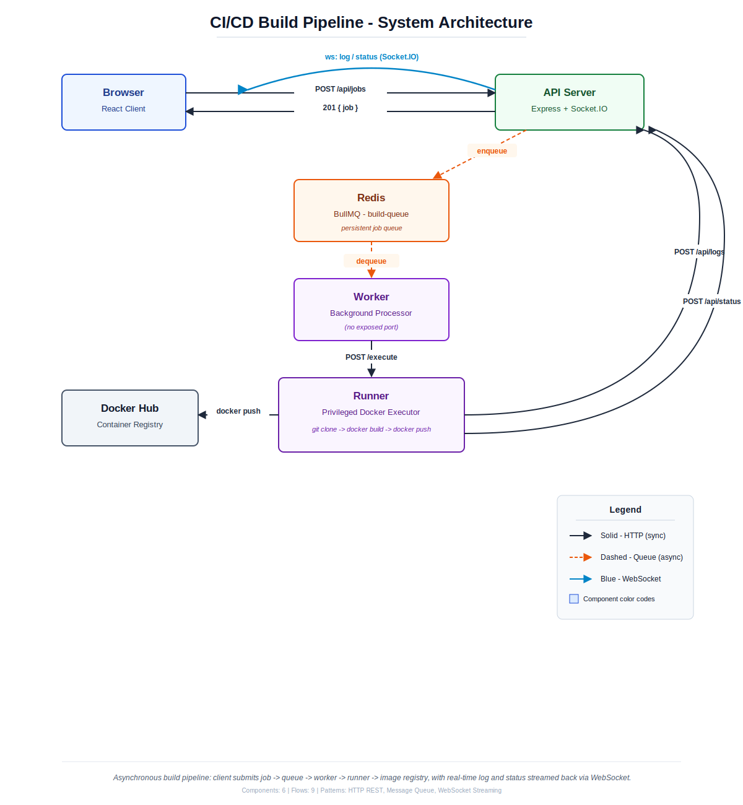

# Mini GitHub Action

> A miniature, self-hosted CI platform that turns any Git repository into a published Docker image — paste a repo URL, watch live build logs, then copy a single `docker pull` command when it finishes.

`mini-github-action` is a from-scratch clone of the GitHub Actions experience rebuilt on Node.js, React, BullMQ, Socket.IO, and the Docker CLI. The system is split into five loosely-coupled services that together clone a repository, build a Docker image from its `Dockerfile`, push the image to Docker Hub, and stream the entire pipeline to a dashboard — all in real time, all behind one REST/WebSocket entry point.

The repository is itself a CI/CD project: GitHub Actions workflows (`ci.yml`, `cd.yml`, `e2e.yml`) validate, build, publish, and deploy the stack on every merge to `main`.


---

## Table of Contents

1. [Philosophy: Why This Approach](#1-philosophy-why-this-approach)
2. [The Learning Science Behind Our Methods](#2-the-learning-science-behind-our-methods)
3. [Professional Standards](#3-professional-standards)
4. [Lab Structure](#4-lab-structure)
5. [Writing Style Guide](#5-writing-style-guide)
6. [Active Learning Techniques](#6-active-learning-techniques)
7. [Code and Commands](#7-code-and-commands)
8. [Visual Elements](#8-visual-elements)
9. [Quality Assurance](#9-quality-assurance)
10. [Common Mistakes to Avoid](#10-common-mistakes-to-avoid)
11. [Templates and Examples](#11-templates-and-examples)
12. [Review Process](#12-review-process)

---

## 1. Philosophy: Why This Approach

This project is built on a few beliefs that guide every architectural decision.

**A real CI system should be understandable in one diagram.** Six services — `frontend`, `server`, `worker`, `runner`, `redis` — form a linear pipeline. There are no circular dependencies and no hidden side effects. When something breaks, the diagram tells you where to look. Complexity hides in well-named modules, not in clever abstractions.

**Concerns should be physically separated.** Each service in this repo has one job and one entry point. The API server is the only service that accepts HTTP from clients. The worker is the only service that talks to BullMQ as a consumer. The runner is the only service that talks to the Docker daemon. The frontend is the only service that talks to Socket.IO. This keeps blast radius small: a misconfigured runner cannot corrupt the queue, and a slow build cannot slow down the dashboard.

**The user sees what's happening, as it happens.** Every stdout line from `git`, `docker build`, and `docker push` is forwarded immediately to the browser. The status badge transitions `queued → running → success` (or `failed`) live, with no need to refresh. The result is a tool you can trust, because you watched it work.

**Job idempotency and isolation matter, even in demos.** Every job gets a unique workspace (`runner/workspace/<jobId>`), a unique image tag (`<docker-username>/<repo-name>:<jobId>`), and a unique ID. Two jobs never collide, even when submitted back-to-back.

---

## 2. The Learning Science Behind Our Methods

This section explains *how* the project is organized so future contributors (and readers of this code) can absorb it quickly. It draws on principles of chunking, progressive disclosure, and feedback loops.

### 2.1 Chunking the system into five "labs"

Beginners absorb unfamiliar systems more easily when the system is split into small, mutually-intelligible pieces. Each of the five services in this repository is one such piece. You can understand any single service without reading the other four — every service has its own `package.json`, its own `Dockerfile`, and its own port. This is the same principle that makes a real lab bench work: instruments are isolated, so a noisy oscilloscope cannot drown out a quiet signal generator.

### 2.2 Progressive disclosure of complexity

Each module shows you only what you need to know to use it. `runner/services/git.service.js` exposes a single function, `cloneRepo(job)`, and hides the spawn-and-stream implementation behind it. The first time you read the system, you can ignore the implementation; once you need to extend the system, the implementation is right there. This is the "shell model" of a function: a small surface area for callers, a deep interior for maintainers.

### 2.3 Immediate feedback through observables

In cognitive science, immediate feedback is one of the strongest predictors of durable learning. This project operationalizes that idea in two ways. First, **build logs are streamed live** over Socket.IO, so the user sees the effect of each pipeline step as it happens. Second, **status transitions are observable**, so the user knows which stage produced which outcome. If a build fails, the UI tells you so within milliseconds of `docker build` exiting non-zero.

### 2.4 Spaced repetition through CI

The GitHub Actions workflows in `.github/workflows/` run the full system end-to-end on every push. Every merge is another exposure to the whole pipeline: clone, env files, build, health checks, cleanup. This is the CI equivalent of spaced repetition: a tiny cognitive load per exposure, repeated often enough that the system's shape becomes second nature.

### 2.5 Mental-model alignment

The directory layout of this repository is designed so the file structure mirrors the mental model. Queue producers live in `server/services/queue.service.js`; queue consumers live in `worker/`. Docker operations live in `runner/services/`. There is no magic; the layout is the truth.

---

## 3. Professional Standards

This codebase tries to look like the kind of code you'd find in a small production system. The conventions are not invented here — they are reused patterns from the Node.js, Docker, and GitHub Actions ecosystems.

### 3.1 CommonJS in services, ESM in the frontend

The four Node services (`server`, `worker`, `runner`) use CommonJS. They run in Docker containers where CommonJS remains the lowest-friction default, and `npm ci --omit=dev` works without ESM-specific bundling. The frontend uses ES modules because Vite, Tailwind, and modern React tooling all assume ESM.

The `package.json` of each service contains a `"type": "commonjs"` (services) or `"type": "module"` (frontend) declaration so that the Node loader knows which parser to use. This is a small but important detail — using the wrong module type surfaces as opaque `require is not defined in ES module scope` errors when a file boundary crosses.

### 3.2 One route file per resource

REST endpoints are grouped by resource, not by HTTP verb. `server/routes/job.routes.js` exposes `POST /api/jobs` and `GET /api/jobs/:id`; `server/routes/log.routes.js` exposes `POST /api/logs`; etc. Each route file delegates to a controller file of the same name in `server/controllers/`. This is the standard MVC split that recruiters expect to see, and it makes route-level changes obvious.

### 3.3 Names follow domain, not implementation

Class and function names describe **what they do for the user**, not how they do it internally. `cloneRepo`, not `spawnGitProcess`. `pushImage`, not `dockerPushWrapper`. The implementation is the implementation; the name is the contract.

### 3.4 Configuration via environment variables, not files

Every runtime parameter the runner needs (`RUNNER_URL`, `DOCKER_USERNAME`, `DOCKER_ACCESS_TOKEN`, `SERVER_URL`) is injected through `.env` files and `process.env`. There is no hardcoded `localhost` in service code; defaults exist but are clearly marked (`|| "http://server:8000"`). This means the same image runs in dev (`docker-compose.yml`) and in prod (`docker-compose.prod.yml`) without code changes.

### 3.5 Dependencies are pinned, not anchored

Where it matters, dependencies are pinned to `^x.y.z` ranges and the lockfile (`package-lock.json`) is committed. Every Docker build uses `npm ci` (not `npm install`) so the CI runner installs exactly what the developer installed.

---

## 4. Lab Structure

> The "lab" of this project is the folder layout. Each part is one instrument; the whole bench is the system.

```
demo-mini-github-action/
├── frontend/                React + Vite + Tailwind dashboard (port 5173)
├── server/                  Express + Socket.IO + BullMQ producer (port 8000)
├── worker/                  BullMQ consumer (no exposed port)
├── runner/                  Privileged Docker executor (port 7000 → 7000)
├── .github/workflows/       CI/CD for the project itself
├── docker-compose.yml       dev stack (builds from source)
└── docker-compose.prod.yml  prod stack (pulls from Docker Hub)
```

### 4.1 `frontend/` — the dashboard

React 19 + Vite 7 + Tailwind 3. The Vite dev server is exposed on port `5173`. The frontend's only responsibilities are (a) letting the user submit a job, (b) listing recent jobs with their live status, and (c) showing the modal that contains the live logs and the final `docker pull` command.

Important files:
- `src/pages/Home.jsx` — header, hero, job form, jobs grid, empty state.
- `src/components/JobForm.jsx` — repository URL + branch input, submission state.
- `src/components/JobCard.jsx` — dashboard tile with live status pill and image preview.
- `src/components/JobModal.jsx` — modal containing `ImageInstallPanel` + `LogsPanel`.
- `src/components/LogsPanel.jsx` — terminal-style log viewer with smart tail-mode.
- `src/components/StatusBadge.jsx` — queued / running / success / failed / cloned pill.
- `src/components/CopyBlock.jsx` — `docker pull` block with one-click clipboard copy.
- `src/components/ImageInstallPanel.jsx` — header + image name + `docker pull` block.
- `src/api/jobApi.js` — `fetch`-based `createJob` that calls `POST /api/jobs`.
- `src/socket/socket.js` — singleton `socket.io-client` connection.

The frontend reads two build-time configuration values from `.env`:
```
VITE_API_URL=http://localhost:8000
VITE_SOCKET_URL=http://localhost:8000
```

### 4.2 `server/` — the API + WebSocket gateway

Express 5 + Socket.IO 4 + BullMQ 5 + ioredis. The server is the only service that accepts user input. It is responsible for:

1. Validating incoming job requests.
2. Persisting jobs in an in-memory `Map` (`server/store/jobStore.js`).
3. Enqueuing jobs on the BullMQ `build-queue`.
4. Accepting log/status/image callbacks from the runner.
5. Broadcasting log and status updates to the browser via Socket.IO.

Important files:
- `index.js` — boots Express + HTTP server + Socket.IO.
- `app.js` — registers routes: `/api/jobs`, `/api/logs`, `/api/status`, `/api/image`, `/health`.
- `controllers/job.controller.js` — `createJob` (mints an ID, stores, enqueues) and `getJob`.
- `controllers/log.controller.js` — appends runner logs to the job store + emits them.
- `controllers/status.controller.js` — updates status in store + emits to the Socket.IO room.
- `controllers/image.controller.js` — stores the final image name from the runner.
- `controllers/health.controller.js` — returns service health for the CI workflow.
- `services/queue.service.js` — BullMQ producer: `addJobToQueue(job)`.
- `services/job.service.js` — `appendLog(jobId, log)` helper used by the log controller.
- `socket/socket.js` — Socket.IO server: `initSocket`, `emitLog`, `emitStatus`.
- `store/jobStore.js` — in-memory job map (no persistence; see §10).
- `config/redis.js` — singleton `ioredis` connection to the `redis` service.

Endpoint summary:

| Method | Path                | Purpose                                                                 |
| ------ | ------------------- | ----------------------------------------------------------------------- |
| POST   | `/api/jobs`         | Create a new build job. Body: `{ repoUrl, branch }`.                    |
| GET    | `/api/jobs/:id`     | Read a job (used as a polling fallback for image updates).              |
| POST   | `/api/logs`         | Append a log line to a job. Body: `{ jobId, message }`.                 |
| POST   | `/api/status`       | Update a job's status. Body: `{ jobId, status }`.                       |
| POST   | `/api/image`        | Set the final image name pushed by the runner.                          |
| GET    | `/health`           | Health check.                                                           |

### 4.3 `worker/` — the queue consumer

BullMQ worker over `build-queue`. There is one file that matters: `processors/buildProcessor.js`. It receives a BullMQ job and forwards it to the runner via `services/runnerService.js` (a single `axios.post(RUNNER_URL + "/execute")`).

```
queue  ─► worker (buildProcessor)  ─► runner (POST /execute)
```

The worker's `.env` only needs `RUNNER_URL=http://runner:7000`. It is otherwise stateless.

### 4.4 `runner/` — the privileged executor

This is where the actual build pipeline lives. The runner mounts `/var/run/docker.sock` and runs in privileged mode so it can spawn `docker build`, `docker push`, and `git clone` against the host daemon. Each module has a single responsibility:

- `services/git.service.js` — `cloneRepo(job)` spawns `git clone` into `runner/workspace/<jobId>`.
- `services/build.service.js` — `runBuild(job, repoPath)` runs `npm install` / `npm run build` for Node projects (currently disabled in favor of direct Docker build).
- `services/docker.service.js` — `buildImage(job, repoPath)` runs `docker build -t <user>/<repo>:<jobId> .` against the cloned path.
- `services/registry.service.js` — `login(jobId)` / `logout(jobId)` use `docker login --password-stdin`.
- `services/image.service.js` — `pushImage(jobId, imageName)` runs `docker push` and streams every line to the server.
- `services/imageInfo.service.js` — `sendImage({jobId,imageName})` POSTs to the server's `/api/image`.
- `services/status.service.js` — `sendStatus(jobId, status)` POSTs to the server's `/api/status`.
- `services/log.service.js` — `sendLog(jobId, message)` POSTs to the server's `/api/logs`.
- `services/health.service.js` — health-check helper with retry.
- `controllers/execute.controller.js` — top-level pipeline that orchestrates the above.
- `routes/execute.routes.js` — `POST /execute` mounted at `app.use("/execute", executeRoutes)`.

The runner's `.env` must contain:

```
RUNNER_URL=http://runner:7000    # used by the worker, not the runner itself
SERVER_URL=http://server:8000
DOCKER_USERNAME=<your-dockerhub-user>
DOCKER_ACCESS_TOKEN=<your-dockerhub-pat>
```

### 4.5 `.github/workflows/` — the project's own CI/CD

- **`ci.yml`** — On push / PR to `main`: recreates `.env` files from repo secrets, builds and starts the prod stack, curls `/health` endpoints for server/runner/frontend/redis, submits a fake build job against `https://github.com/octocat/Hello-World.git`, then tears the stack down with `docker compose down -v`.
- **`cd.yml`** — On successful `CI Pipeline` (`workflow_run`): builds and pushes the four production images (`tanjim100/ci-server`, `…ci-worker`, `…ci-runner`, `…ci-frontend`) to Docker Hub, then SSHes into the EC2 host, `git pull`s, recreates the env files, and brings the stack up with `docker compose -f docker-compose.prod.yml up -d`.
- **`e2e.yml`** — Manually triggered (`workflow_dispatch`): same smoke test as `ci.yml` but against the dev compose stack.

---

## 5. Writing Style Guide

> This section applies to code comments, commit messages, and the long-form sections of any future documentation.

### 5.1 Comments explain *why*, not *what*

Good code is largely self-documenting. A comment should only appear when the next reader would otherwise miss a constraint. Examples from this codebase:

> *"The runner mounts `/var/run/docker.sock` and runs `privileged: true` so it can spawn `docker build` against the host daemon."*

That kind of comment travels with the code. Comments like `// increment i` are noise.

### 5.2 Commit messages follow Conventional Commits

We use `feat:`, `fix:`, `refactor:`, `docs:`, `chore:`, and `test:` prefixes. The body, when present, is wrapped at 72 characters and explains the motivation, not the diff.

### 5.3 Variable names mirror the domain

- `repoUrl`, not `u` or `input`.
- `jobId`, not `id` (the prefix removes ambiguity in a multi-component system).
- `imageName`, not `out` or `result`.

### 5.4 Logs are first-class artifacts

Every line a user sees is tagged with `📦 Cloning repository…`, `🐳 Building Docker image …`, `✅ …`, etc. The emoji convention is intentional: it creates a visual rhythm in the logs that scans faster than text alone.

### 5.5 No silent failures

Every `try { await … } catch (err) { console.error(err) }` either retries, falls back, or surfaces the error to the UI. The runner's `executeJob` controller is the canonical example: it always calls `sendStatus(jobId, "failed")` in the catch block, never lets the job silently die.

---

## 6. Active Learning Techniques

> This section is for readers who want to extend the project. The recipes below mirror the cognitive science ideas in §2.

### 6.1 Read one service end-to-end before touching another

Pick one of `server`, `worker`, `runner`, or `frontend`. Read its `index.js`, then its top-level routes/controllers, then its services. Don't cross service boundaries until the first one is clear. The system is small enough that you can hold one service in your head; the failure mode of newcomers is to read all five at once.

### 6.2 Trace one job end-to-end

Open five files in your editor, side-by-side:

1. `frontend/src/components/JobForm.jsx` — the entry point.
2. `server/controllers/job.controller.js` — receives the request.
3. `server/services/queue.service.js` — enqueues on `build-queue`.
4. `worker/processors/buildProcessor.js` — dequeues, calls runner.
5. `runner/controllers/execute.controller.js` — the actual pipeline.

Walk the execution with a debugger or with `console.log`s. This is the single highest-leverage exercise in the project.

### 6.3 Modify, don't rewrite

Pick one extension from §11 and add it. Resist the urge to refactor while adding it. Each commit should be small, verifiable, and revertable.

### 6.4 Reproduce a failure on purpose

Stop the runner mid-build (`docker stop ci-runner`). Watch the dashboard: the worker will retry or the job will hang, and the logs will reveal the timeout path. Then start the runner again and confirm recovery. This is the cheapest way to learn the system's fault tolerance.

### 6.5 Pair-program with the Socket.IO room model

Add a `console.log` in `server/socket/socket.js`'s `initSocket`: print `io.sockets.adapter.rooms` on every `connection`. Then open two browser tabs to the same job. The room will contain two socket IDs, both receiving the same `log` events. This visualizes the multicast model and makes it concrete.

---

## 7. Code and Commands

> All commands assume you are at the repository root unless otherwise stated.

### 7.1 Bring up the dev stack

```bash
docker compose up --build       #for development
docker compose docker-compose.prod.yml up --build     #for production
```

The first build will pull `redis:7`, install Node deps for all four services, and prepare the runner with `git` and `docker.io` (`runner/Dockerfile`). Subsequent starts are near-instant.

Services and their ports:

| Service     | Host port | Container port | URL                          |
| ----------- | --------- | -------------- | ---------------------------- |
| frontend    | `5173`    | `5173`         | http://localhost:5173        |
| server      | `8000`    | `8000`         | http://localhost:8000        |
| runner      | `7001`    | `7000`         | http://localhost:7001        |
| redis       | `6379`    | `6379`         | redis://localhost:6379       |

### 7.2 Required `server/.env`

```
PORT=8000
REDIS_HOST=redis
```

### 7.3 Required `worker/.env`

```
RUNNER_URL=http://runner:7000
REDIS_HOST=redis
```

### 7.4 Required `runner/.env`

```
SERVER_URL=http://server:8000
DOCKER_USERNAME=<your-dockerhub-username>
DOCKER_ACCESS_TOKEN=<your-dockerhub-access-token>
```

> ⚠️ The runner is `privileged: true` and mounts `/var/run/docker.sock`. Only run it on a machine you trust.

### 7.5 Required `frontend/.env`

```
#dev mode
VITE_API_URL=http://localhost:8000
VITE_SOCKET_URL=http://localhost:8000

#production mod
VITE_API_URL=http://localhost:8000
VITE_SOCKET_URL=http://localhost:8000
```

### 7.6 Submit a build manually

```bash
curl -X POST http://localhost:8000/api/jobs \
  -H "Content-Type: application/json" \
  -d '{
    "repoUrl": "https://github.com/<owner>/<repo>.git",
    "branch": "main"
  }'
```

The response is a JSON document with the new `job.id`. Open `http://localhost:5173`, paste the same `repoUrl` again, and you'll see the job card appear.

### 7.7 Bring down the stack

```bash
docker compose down -v
```

The `-v` flag removes the `redis` volume and any cached workspace directories.

### 7.8 Pull the image your build produced

After a successful build, the runner prints and the dashboard copies a command like:

```bash
docker pull <DOCKER_USERNAME>/<repo-name>:<jobId>
docker run --rm -p 3000:3000 <DOCKER_USERNAME>/<repo-name>:<jobId>
```

Replace the ports with whatever your `Dockerfile` exposes.

---

## 8. Visual Elements

> The user-facing visuals follow GitHub Actions' design language. This section explains the rationale and the conventions used.

### 8.1 Color tokens

Defined as CSS custom properties at the top of `frontend/src/index.css`:

| Token                | Hex        | Used for                            |
| -------------------- | ---------- | ----------------------------------- |
| `--gh-bg`            | `#0d1117`  | Page background.                    |
| `--gh-bg-elevated`   | `#161b22`  | Cards, modal panels, header bar.    |
| `--gh-border`        | `#30363d`  | Card borders, dividers.             |
| `--gh-text`          | `#e6edf3`  | Body text.                          |
| `--gh-text-muted`    | `#8b949e`  | Secondary text, metadata.           |
| `--gh-accent`        | `#2f81f7`  | Primary brand / link hover.         |
| `--status-queued`    | `#d29922`  | Yellow pill (waiting).              |
| `--status-running`   | `#2f81f7`  | Blue pill (in progress, spinner).   |
| `--status-success`   | `#3fb950`  | Green pill (finished OK).           |
| `--status-failed`    | `#f85149`  | Red pill (error).                   |
| `--status-cloned`    | `#a371f7`  | Purple pill (sub-state, e.g. cloned). |

### 8.2 Status pill

`StatusBadge.jsx` renders a pill with an icon and a label:

- `queued` → 🕒 Clock + yellow.
- `running` → 🔄 Loader (animated spin) + blue.
- `success` → ✅ CheckCircle + green.
- `failed` → ❌ XCircle + red.
- `cloned` → 🔀 GitBranch + purple.

### 8.3 Copy block

`CopyBlock.jsx` is a code-style block with a "Copy" button in the top-right corner. After a successful copy, the button briefly turns green and shows "Copied". The fallback path uses a hidden `<textarea>` and `document.execCommand("copy")` for the few environments where `navigator.clipboard` is unavailable.

### 8.4 Live tail indicator

`LogsPanel.jsx` shows a small animated green dot next to the word "Live" whenever the log viewer is auto-scrolling to the bottom. When the user scrolls up to read history, the indicator switches to a static purple dot and the word becomes "Paused".

### 8.5 Empty state

When no jobs exist, `Home.jsx` renders an empty state with a centered icon, title, and a one-line description. The visual rhythm — large icon, single heading, one body sentence — is borrowed from GitHub's own empty states (e.g. `github.com/<user>?tab=repositories` when a user has none).

### 8.6 Modal animation

`JobModal.jsx` uses two layered CSS animations: `backdrop-fade` (0.15s opacity from 0 → 1 on the dim layer) and `modal-pop` (0.18s scale + translateY for the panel). Together they read as one fluid motion.

---

## 9. Quality Assurance

> Every layer has its own quality bar. The CI workflow enforces them.

### 9.1 Frontend

- ESLint (`eslint .`) is wired to `npm run lint` and runs in the default Vite scripts. Errors block the build.
- The production build is verified with `npm run build`. We do not commit `dist/`.
- Visual checks: open two browser tabs on the same job; both should show identical logs.

### 9.2 Backend services

- No automated tests are shipped yet; the trusted path is `ci.yml` running the full stack end-to-end and observing /health and a real build attempt.
- A failing container logs to stderr; `docker compose logs` is the first stop in any investigation.

### 9.3 End-to-end

`e2e.yml` is the explicit `workflow_dispatch` button you press when you want to verify a change against the dev compose stack without going through the prod images. Use it for any change that touches `server`, `worker`, or `runner`.

### 9.4 Production

`ci.yml` runs on every push/PR to `main`. `cd.yml` runs only when `ci.yml` succeeded, and only the `if: github.event.workflow_run.conclusion == 'success'` branch deploys. A broken main branch cannot accidentally reach the production EC2 host.

---

## 10. Common Mistakes to Avoid

> The fastest path through a codebase is knowing where its foot-guns live. Here are the ones in this project.

### 10.1 Forgetting `privilegied: true` on the runner

If you remove `privileged: true` or the `/var/run/docker.sock` mount from `docker-compose.yml`, the runner will fail to start `docker build` with a permission error. There is no fallback path; the runner needs the host daemon.

### 10.2 Hardcoding ports

Every cross-service URL uses an environment variable. Resist the temptation to write `http://localhost:8000` inside the worker or runner — `localhost` inside a container refers to the container itself, not the host. Use `http://server:8000` (the Docker Compose service name) or the injected variable.

### 10.3 Treating `jobStore` as durable

`server/store/jobStore.js` is an in-memory `Map`. Restarting the server wipes every job. If you need persistence, back the store with Redis (`ioredis` is already a dep) or a database. Until then, do not assume a server restart preserves history.

### 10.4 Using `Date.now()` as the only ID source

Two jobs submitted in the same millisecond collide. For demos this is fine, but for anything load-bearing, switch to `crypto.randomUUID()` or pass the ID back to the server from the client.

### 10.5 Allowing `git clone` to run on an untrusted URL

If you expose this project publicly, the runner will `git clone` whatever URL is submitted. Add an allowlist in `server/controllers/job.controller.js` before doing so, or run the runner in a network namespace with no egress.

### 10.6 Building non-Docker projects

The current pipeline assumes the repository contains a `Dockerfile`. If you submit a repo without one, `docker build` fails with a clear error. The `npm` build path (`runner/services/build.service.js`) is wired but commented out in `execute.controller.js`; turn it on if you want to support repos without a `Dockerfile`.

### 10.7 Ignoring the modal listener lifecycle

`JobModal.jsx` and `JobCard.jsx` both register a `socket.on("status", handler)` listener. Each `useEffect` cleanup uses `socket.off("status", handler)` with its own handler reference, which works because Socket.IO matches by reference. If you refactor those handlers into a shared utility, double-check that the cleanup still references the same function so the listener is actually removed.

---

## 11. Templates and Examples

### 11.1 README task recipe

```markdown
- id: <T-NNN>
  title: <short verb phrase>
  service: server | worker | runner | frontend | infra
  files: <comma-separated list>
  risk: low | medium | high
  tests:
    - <how to verify>
```

Every change ships with a one-line title, the affected files, a risk classification, and a verification step.

### 11.2 Component template (React)

```jsx
import { useEffect, useState } from "react";
import { SomeIcon } from "lucide-react";

export default function ComponentName({ propA, propB }) {
  const [state, setState] = useState(propA);

  useEffect(() => {
    // Subscribe or side-effect
    return () => {
      // Cleanup (off, clearInterval, etc.)
    };
  }, [propA]);

  return (
    <div className="gh-card p-4">
      {/* ... */}
    </div>
  );
}
```

### 11.3 Service template (Node)

```js
// services/<domain>.service.js
const { spawn } = require("child_process");
const { sendLog } = require("./log.service");

async function doThing(input) {
  return new Promise((resolve, reject) => {
    sendLog(input.id, `Doing thing: ${input.label}`);

    const proc = spawn("tool", ["--flag", input.value]);

    proc.stdout.on("data", (chunk) => sendLog(input.id, chunk.toString()));
    proc.stderr.on("data", (chunk) => sendLog(input.id, chunk.toString()));
    proc.on("close", (code) => (code === 0 ? resolve() : reject(new Error("fail"))));
  });
}

module.exports = { doThing };
```

### 11.4 API endpoint template

```js
// controllers/<resource>.controller.js
const store = require("../store/jobStore");

exports.action = (req, res) => {
  const { id } = req.body;
  const item = store.get(id);
  if (!item) return res.status(404).json({ error: "not found" });
  store.update(id, /* … */);
  res.json({ success: true });
};
```

```js
// routes/<resource>.routes.js
const router = require("express").Router();
const c = require("../controllers/<resource>.controller");
router.post("/", c.action);
module.exports = router;
```

### 11.5 GitHub Actions workflow snippet

```yaml
name: Validate Service
on: [push]

jobs:
  validate:
    runs-on: ubuntu-latest
    steps:
      - uses: actions/checkout@v4
      - name: Prepare env
        run: echo "${{ secrets.<X>_ENV }}" > <service>/.env
      - name: Build
        run: docker compose build <service>
      - name: Boot
        run: docker compose up -d <service>
      - name: Health
        run: curl --fail http://localhost:<port>/health
```

---

## 12. Review Process

> Code review is the place where the project gets its second brain. The patterns below keep reviews short, fair, and useful.

### 12.1 Pull request template

```markdown
### What does this change?
<one-paragraph summary>

### Why?
<motivation; link the issue or design doc>

### How was it tested?
<commands run, screenshots, logs>

### Risk
- [ ] low
- [ ] medium
- [ ] high

### Checklist
- [ ] `npm run build` passes (frontend)
- [ ] `npm run lint` passes (frontend)
- [ ] `docker compose up` boots cleanly
- [ ] End-to-end smoke via `.github/workflows/e2e.yml` (if applicable)
- [ ] At least one reviewer from the affected service
```

### 12.2 Definition of Done

A change is "done" when all of the following hold:

1. **It works locally.** `docker compose up` brings the affected service to a healthy state.
2. **It works in CI.** If the change is non-trivial, the existing workflows (`ci.yml`, `e2e.yml`) pass with the change included.
3. **The README is updated** if a new env variable, endpoint, or service is added.
4. **The diff is reviewed** by at least one person who is not the author.
5. **The commit history is clean** — squash fix-ups before merging.

### 12.3 Severity rubric for comments

| Severity | When to use                                           | Example                                                              |
| -------- | ----------------------------------------------------- | -------------------------------------------------------------------- |
| `nit`    | Cosmetic; safe to ignore.                             | "Could use `?? null` here for clarity."                              |
| `suggestion` | Non-blocking; author may agree or disagree.       | "Consider extracting this into a helper for testability."            |
| `question` | Genuinely asking what the code intends.            | "Why is `setImageName` here instead of inside the polling tick?"     |
| `blocker` | Prevents merge.                                    | "This drops the `imageName` for an existing job — please add a test." |

Reviewers pick the lowest severity that fits; authors don't need to act on `nit`s.

### 12.4 Release process

1. Merge feature branches into `main`.
2. `ci.yml` runs and gates the `cd.yml` deploy.
3. `cd.yml` builds the four images, pushes to Docker Hub, and deploys to the EC2 host.
4. Watch the EC2 logs (`docker compose -f docker-compose.prod.yml logs -f`) for the first build submitted after the deploy.
5. If anything looks wrong, `git revert` is preferable to `git reset --hard` — the CI will redeploy from the previous tag.

---

## Appendix A — End-to-End Flow (visual)



```
┌────────────┐   POST /api/jobs        ┌─────────────────┐
│  Browser   │ ──────────────────────► │  API Server     │
│  (React)   │ ◄────────────────────── │   (Express)     │
└────────────┘   201 {job}             └─────────────────┘
                                           │  enqueue
                                           ▼
                                     ┌──────────────-┐
                                     │ Redis (BullMQ │
                                     │   build-queue)│
                                     └──────────────-┘
                                           │ dequeue
                                           ▼
                                     ┌──────────────┐
                                     │ Worker       │
                                     │ (no exposed  │
                                     │  port)       │
                                     └──────────────┘
                                           │ POST /execute
                                           ▼
                                     ┌──────────────────-┐
                                     │ Runner (privileged│
                                     │  Docker executor) │
                                     └──┬────────────┬──-┘
                                        │            │
                                  git clone      docker build
                                        │            │
                                        ▼            ▼
                                  docker push      Docker Hub
                                        │
                        POST /api/logs  │ POST /api/status
                                        ▼            ▼
                                 ┌─────────────────────────┐
                                 │ API Server + Socket.IO  │
                                 └─────────────────────────┘
                                        │  ws: log / status
                                        ▼
                                 ┌────────────┐
                                 │  Browser   │
                                 └────────────┘
```

## Appendix B — Service Ports

| Service  | Container port | Host port (dev) | Purpose                              |
| -------- | -------------- | --------------- | ------------------------------------ |
| frontend | `5173`         | `5173`          | Vite dev server / static preview.    |
| server   | `8000`         | `8000`          | REST API + Socket.IO server.         |
| runner   | `7000`         | `7001`          | Privileged build executor.           |
| worker   | —              | —               | BullMQ consumer (internal only).     |
| redis    | `6379`         | `6379`          | BullMQ broker.                       |

---

_Built and maintained as a learning artifact for distributed systems, queue-backed workers, and live-streamed UX._
